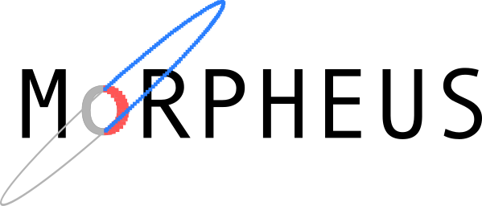

----

.. image:: https://travis-ci.com/morpheus-project/morpheus.svg?branch=master
    :target: https://travis-ci.com/morpheus-project/morpheus

.. image:: https://codecov.io/gh/morpheus-project/morpheus/branch/master/graph/badge.svg
    :target: https://codecov.io/gh/morpheus-project/morpheus

.. image:: https://img.shields.io/badge/code%20style-black-000000.svg
    :target: https://github.com/ambv/black

Morpheus is a neural network model used to generate pixel level morphological
classifications for sources. This model can be used to generate segmentation
maps or to inform other photometric measurements with granular morphological
information.

**TODO**:

* Move documentation to ReadTheDocs
* Make pip package
* Make leaflet map
* Pick an example image to classify
* Make colab notebook
* Write more tests
* Create a Tensorflow.js version of the model
